# Laufbursche Edition

An alternative app for SoFlow e-scooters.

> **This is a feasibility study.** It exists to show what a SoFlow scooter's Bluetooth protocol makes possible, not to be a finished product. Error-free operation is not promised and there is no warranty of any kind. Whatever you do with it, you do at your own risk. Read the [Disclaimer](#disclaimer--trademarks) before you install it.

<!-- Project repository: https://github.com/Laufbursche42/sf-lb-edition -->
**[Download the latest release](https://github.com/Laufbursche42/sf-lb-edition/releases/latest)**

## Table of contents

- [For users](#for-users)
  - [What the app is](#what-the-app-is)
  - [Supported models](#supported-models)
  - [Features](#features)
    - [Dashboard](#dashboard)
    - ["All values" telemetry](#all-values-telemetry-scroll-down-on-the-main-screen)
    - [Connection](#connection)
    - [Scooter settings](#scooter-settings)
    - [Speed unlock (triple-tap)](#speed-unlock-triple-tap)
    - [In-app updates](#in-app-updates)
    - [Info & diagnostics](#info--diagnostics)
    - [Battery info](#battery-info)
    - [Screen streaming](#screen-streaming)
    - [Offline bicycle navigation](#offline-bicycle-navigation)
    - [Offline maps](#offline-maps)
    - [Recording, logging & preferences](#recording-logging--preferences)
  - [Screenshots](#screenshots)
  - [Installing the app](#installing-the-app)
  - [Privacy & data protection](#privacy--data-protection)
  - [Permissions](#permissions)
  - [Disclaimer & Trademarks](#disclaimer--trademarks)
- [For developers](#for-developers)
  - [Architecture](#architecture)
  - [Prerequisites](#prerequisites)
  - [Building from source](#building-from-source)
    - [Debug build](#debug-build)
    - [Release build](#release-build)
    - [Debug vs release](#debug-vs-release)
  - [BLE protocol reference](#ble-protocol-reference)
    - [1. Model families](#1-model-families)
    - [2. Transports & connection](#2-transports--connection)
    - [3. Crypto](#3-crypto)
    - [4. Frame formats](#4-frame-formats)
    - [5. Commands](#5-commands)
    - [6. Telemetry](#6-telemetry)
    - [7. Operation notes](#7-operation-notes)
- [License](#license)

# For users

## What the app is

Laufbursche Edition is a standalone, alternative Android app for SoFlow e-scooters. It works completely offline and talks to your scooter directly over Bluetooth LE. There is no SoFlow account, no login and no cloud - just install the app, connect to your scooter and you are ready to go.

The app reads whatever the scooter reports over Bluetooth and only ever writes the single command you trigger, so it stays safe across models. Its purpose is to expose the top-speed setting the SoFlow BLE protocol carries, plus the everyday controls (ride mode, lock, lights) and the live telemetry the scooter streams.

## Supported models

The app classifies the connected scooter from its Bluetooth name (the `SFS...` advertising prefixes, or the plain `SoFlow` / `SOFLOW` name that newer units broadcast) and, where the name is ambiguous, from the GATT service it exposes. The controllers fall into three protocol families - **D7**, **SO3** and **SO6** - and the app picks the right transport, crypto and command set per model.

Known models the protocol covers:

| Model | Family | Speed unlock over BLE |
|-------|--------|-----------------------|
| SO4, SO myTIER | D7 | yes |
| SO X | D7 | yes |
| SO1, SO2 Air | SO3 | yes |
| SO2 Air (2nd gen), SO2 Zero, SO2 Grover, SO2+ Grover | D7 | yes |
| SO3, SO5 | SO3 | yes |
| SO5 Pro | D7 | yes |
| SO One, SO One+, SO One Pro | D7 | yes |
| SO4 Pro GT / GT2, SO4 Pro Core2 | D7 (KingMeter) | yes |
| SO4 Pro Max, SO4 Pro Max 2 | D7 | yes |
| SO One Lite, SO One Lite Pro, SO One Prime, SO One Prime Max | D7 | yes |
| SO6 | SO6 | no (no BLE speed command) |
| SO4 UL | SO6 | no (no BLE speed command) |

The **SO6** and **SO4 UL** run the SO6 protocol, which carries no over-the-air speed command, so the app offers lock/unlock and telemetry on them but not a top-speed change. Every other model above accepts the top-speed command over Bluetooth. Whether a given controller actually rides faster once the value is written is a device test - the command sets the target, the factory clamp in the firmware may still cap it.

## Features

Everything below is implemented and shipping in the app.

### Dashboard

- **Live speed drum** - the scooter's own measured speed, side by side with GPS speed.
- **Hero tiles** - state of charge, current ride mode and pack current at a glance.
- **Voltage, current and power tiles** read live from the controller.
- **Lock tile** showing whether the scooter reports itself locked or unlocked.

### "All values" telemetry (scroll down on the main screen)

- Shows **every value the scooter reports** for its family: speed, ride mode, pack voltage, current, power, energy, trip and total distance, battery percentage, fault state, dark-mode state and the controller / display / CPU firmware versions.
- **Each row has a "?" help popup** explaining what the value means.
- **Stale values clear when disconnected** so you never read an old number as live.
- The exact value set depends on the model family - the SO6 controllers, for example, report only voltage, current and power and no speed, mode, battery or distance, and the app shows what that controller actually sends rather than guessing the rest.

### Connection

- **Bluetooth LE connect** with a Bluetooth-glyph indicator: **green = connected, red = disconnected**.
- **Broad scan** on the SoFlow advertising names (`SFS...` prefixes plus the plain `SoFlow` / `SOFLOW` name), then model classification once the link is up.
- **Remembers the last scooter and auto-reconnects.**
- **"Last device" quick-reconnect** button.

### Scooter settings

- **A "?" help popup on every setting.**
- **Top speed** - set the maximum speed the controller aims for, in 0.1 km/h steps, on every model except SO6 and SO4 UL.
- **Ride mode** - eco / normal / sport, mapped to the right command for the model's family.
- **Lock / unlock** - immobilise the scooter or release it over Bluetooth.
- **Lights** - headlight on/off and dark-mode display, on the models whose family exposes them.
- **Battery unlock** - on the D7 family, release the battery lock.
- **Units** - switch the scooter's own display between km and miles, where the model supports it.
- **Live refresh** while the settings screen is open, without clobbering a change you make on the scooter's own display.
- **The app never guesses a value it did not read.** A setting is offered only when the connected model's family actually supports it; anything the controller does not report is left blank rather than filled with a default.

### Speed unlock (triple-tap)

On every model that carries a BLE speed command, **triple-tap the speed tile** on the main screen to unlock or re-lock the top speed over Bluetooth. Unlocking sends the open top-speed value; re-locking sends the road-legal value back. The tile colour reflects the state the app last set. This is the tuning lever the SoFlow protocol exposes: the app writes the target speed, and whether the controller rides it depends on the factory clamp in its firmware.

The scooter can also be fully **locked or unlocked** (immobiliser) from the settings, which is a separate control from the speed unlock.

### In-app updates

- **Update banner in the Settings menu** - a banner appears when a newer version of the app is available. Tapping it downloads the APK to your Downloads folder and opens the Android installer, so you confirm the install yourself like any downloaded APK.
- **App updates** come from the project's GitHub Releases; the check runs at app start. It only reaches the network for that check and the download you tap - see [PRIVACY.md](PRIVACY.md).
- **"What is new"** opens by itself the first time you run a new version and lists what changed. Closing it counts as read, so it stays out of the way until the next version. The Settings menu reopens it any time.

### Info & diagnostics

- **Error / fault** view - read out the fault state the scooter reports.
- **Info page** showing, read-only and read live from the scooter over Bluetooth: the controller, display and CPU firmware versions the scooter reports, plus its Bluetooth name. (The app version lives in the "Version Info & Disclaimer" entry, not here.)

### Battery info

- **Pack readout** read live over Bluetooth with nothing sent to the scooter: system voltage, pack current and, on the models that report it, power and cumulative energy.
- The depth of this page depends on the model family - the SoFlow protocol carries pack voltage, current and power, so this page reflects what the connected controller actually streams rather than a fixed template.

### Screen streaming

- **SRT screen streaming** to your own server - constant ~30 fps, with the server URL encrypted and stored on the device.

### Offline bicycle navigation

- **Live offline routing** that avoids motorways.
- **Enter start and destination** - type each as coordinates or long-press the map to drop the destination. Each field has a **"Here"** button that inserts your current GPS position and leaving the start empty simply means "start from my current position".
- **The map stays where you put it** - dragging the map no longer snaps back to your GPS position, so you can freely look around. Tap the crosshair button to recenter on yourself and resume auto-follow.
- **Route-preference profiles** - pick how the route is calculated:
  - **Balanced** - a mix of roads and paths that avoids motorways - a good all-round route.
  - **Shortest** - the shortest distance (may use bigger roads if they are shorter).
  - **Bike paths** - prefers cycleways and field tracks and avoids main roads as much as possible.
- **"Start navigation" follow-along mode** - after a route is calculated you tap **Start**; the map follows you and zooms in. A big next-turn card shows the upcoming turn and the distance to it plus the remaining distance and a rough ETA. A **Stop** button ends it.
- **Turn-by-turn voice guidance** using your phone's built-in text-to-speech. The directions are **spoken in your phone's language** (most EU languages are supported; anything else falls back to English), while the on-screen text stays English. It uses the TTS voice your phone already has - if that language's voice is not installed it falls back to another installed voice or, failing that, stays silent and just shows the directions on screen. Voice can be turned off.
- **Camping and Charging POI overlays** - charging is filterable by **Schuko / Type 2**. Download the POI data per country with the **Get POI** button on the offline-maps screen (built from OpenStreetMap, ODbL); it lands next to that country's map, so the overlays light up automatically once you have it.
- **Dark-map mode.**
- **"Show map"** - display a recorded ride on the offline map.
- **Automatic routing-data download** - the cycling-directions data (BRouter segments) downloads automatically for the area you route in. You can also download it manually and delete it on the maps page (the same screen where you download offline country maps).

### Offline maps

- **In-app EU offline map download** - per-country maps, no PC and no cables needed.
- Runs as a **background service**, so a download keeps going with the screen locked.
- **Per-map Delete** to free space.

### Recording, logging & preferences

- **GPS track recording** with a configurable interval (**1 / 2 / 5 / 10 / 30 s**) and **per-route GPX export**.
- **Ride log** (**off by default**) - when enabled, it records **all main-screen values once per minute** while you ride. Recording only starts once you are actually moving (after the scooter's speed first goes above 0), so parking or connecting without riding produces no ride. It runs as a foreground service so it keeps recording with the screen off, keeps **all rides** (delete them individually or in bulk by period) and lets you export each ride as **CSV or JSON** from the Scooter Info page (via the Android share sheet).
- **In-app debug logging** - persistent, with a red banner while active and an **export** button. No PC needed.
- **Full-screen toggle** (when off, the app sits below the Android status bar), **km / mph** units (mph converts both speed and distance - Trip, Odometer and saved-route distances - to miles), **light / dark app theme** and a **"Version Info & Disclaimer"** entry.
- **A language switch in the Display settings** turns the whole interface, help popups included, English or German. On the first start the app follows your phone's language and your choice sticks after that.

## Screenshots

The screenshots are not kept in step with every release, so a screen can look different in the version you are running.

<table>
  <tr>
    <td align="center" width="33%">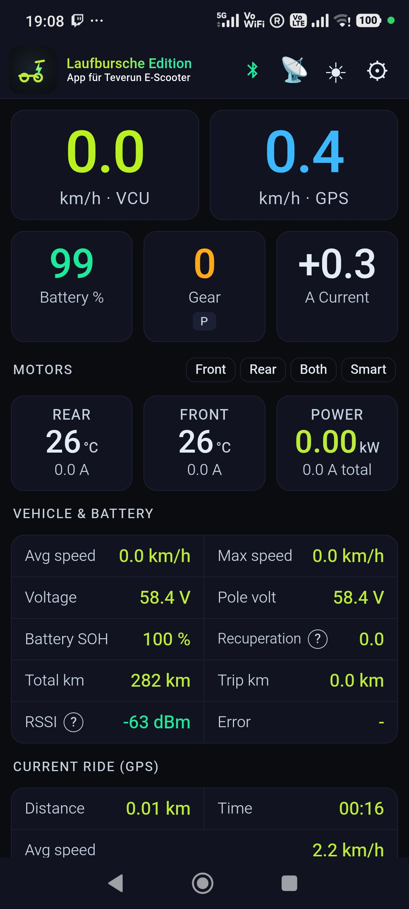</td>
    <td align="center" width="33%">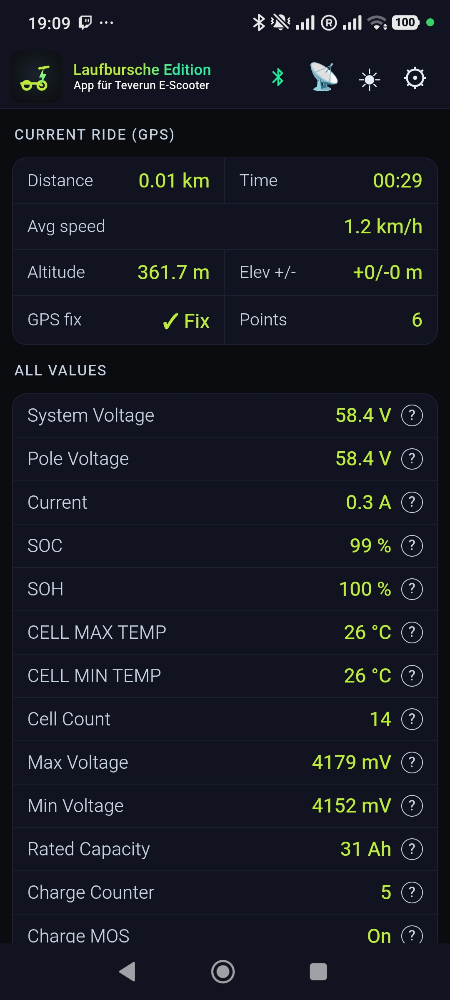</td>
    <td align="center" width="33%"></td>
  </tr>
  <tr>
    <td align="center"></td>
    <td align="center">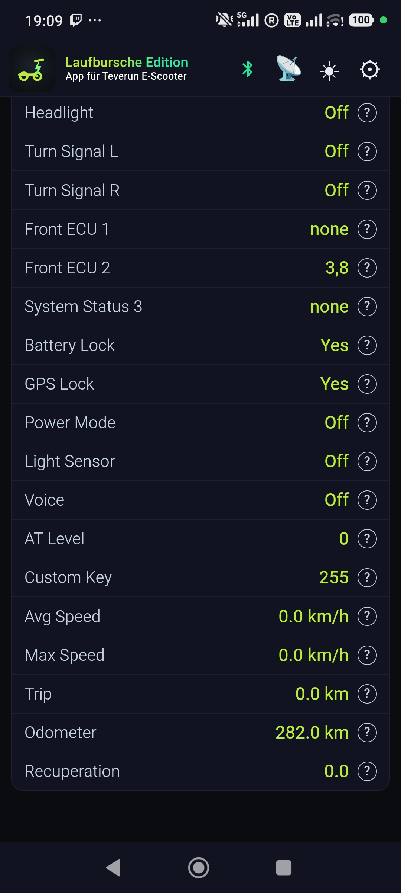</td>
    <td align="center"></td>
  </tr>
  <tr>
    <td align="center"></td>
    <td align="center">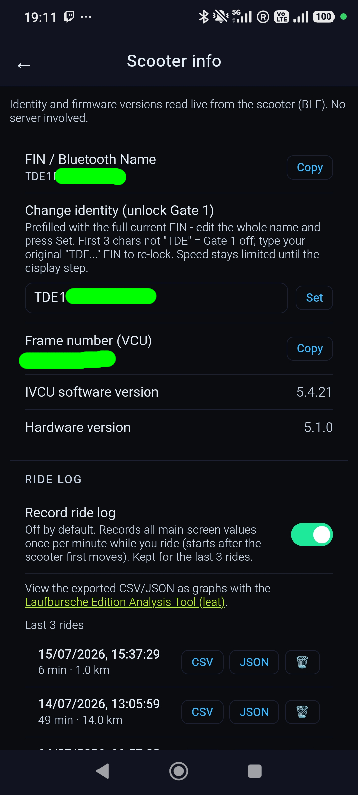</td>
    <td align="center">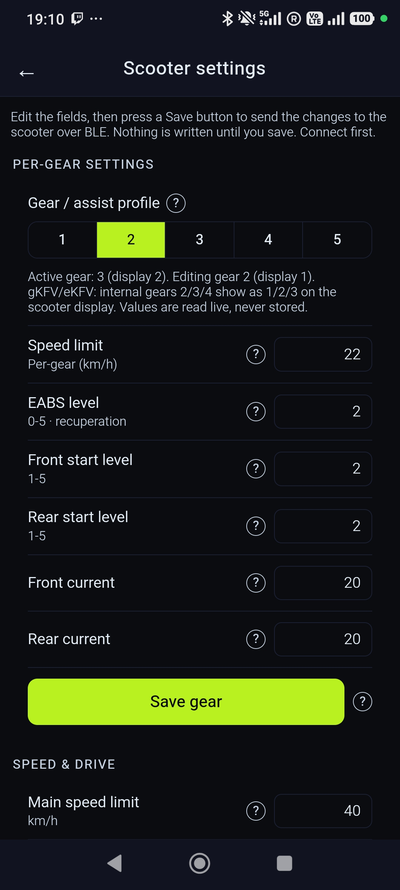</td>
  </tr>
  <tr>
    <td align="center">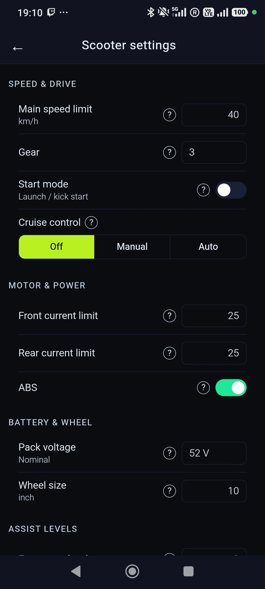</td>
    <td align="center">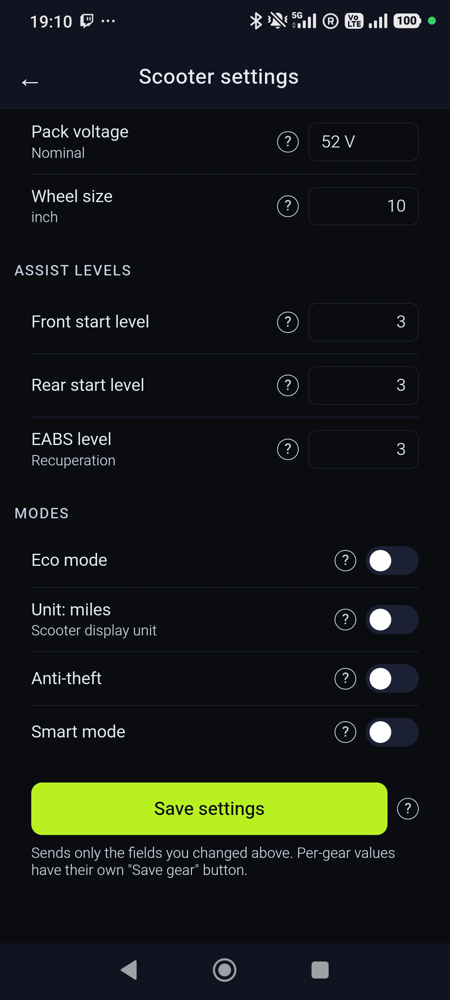</td>
    <td align="center">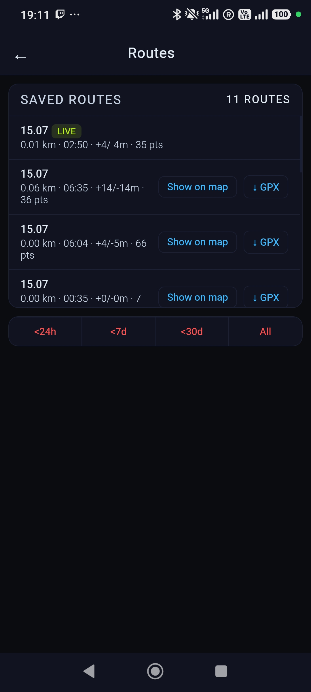</td>
  </tr>
  <tr>
    <td align="center">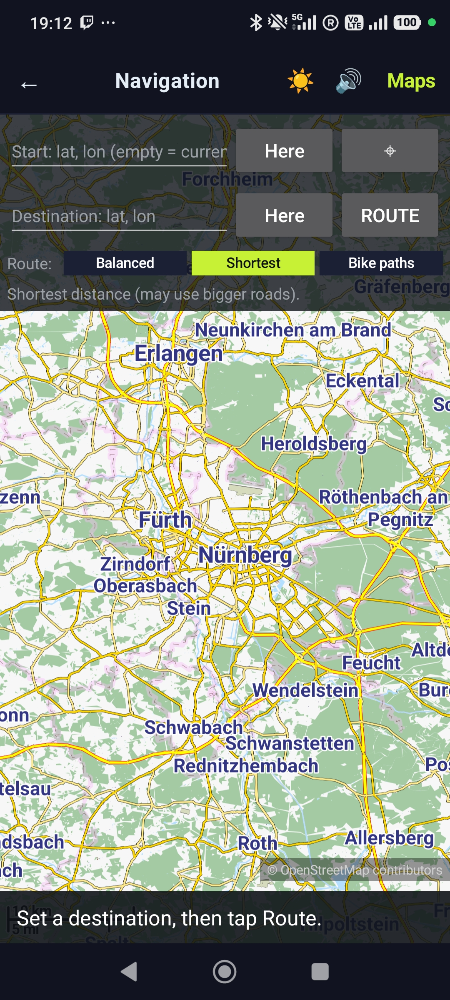</td>
    <td align="center"></td>
    <td align="center">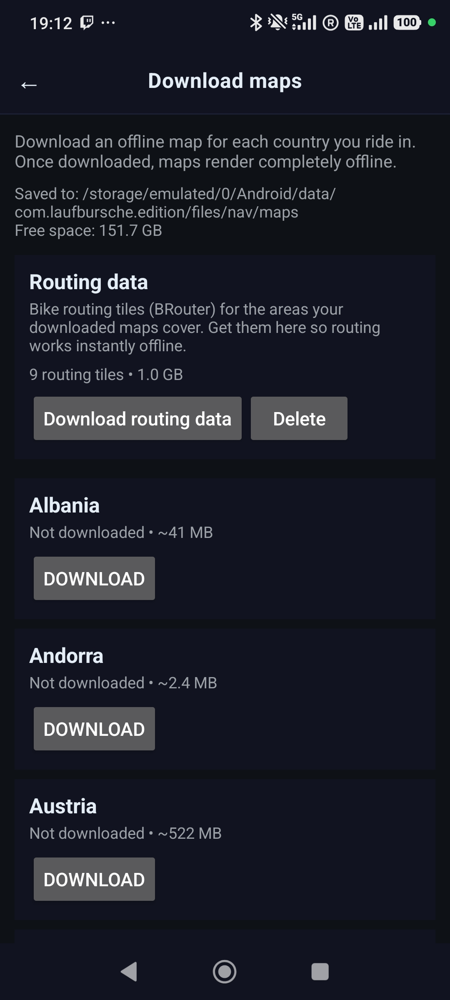</td>
  </tr>
  <tr>
    <td align="center">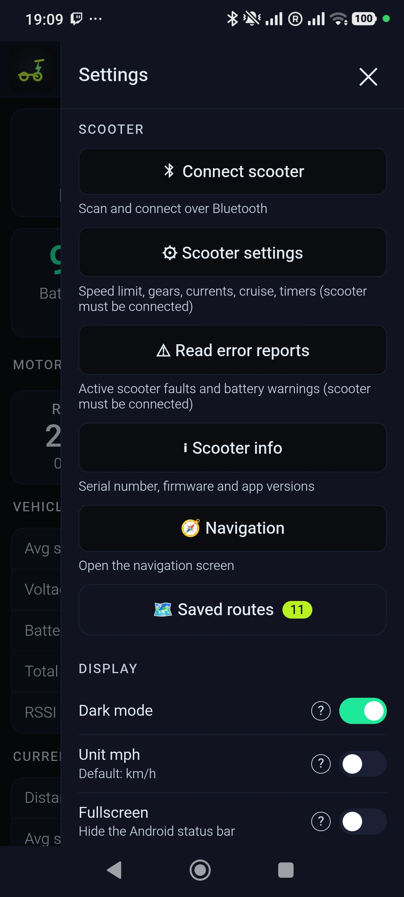</td>
    <td align="center"></td>
    <td align="center">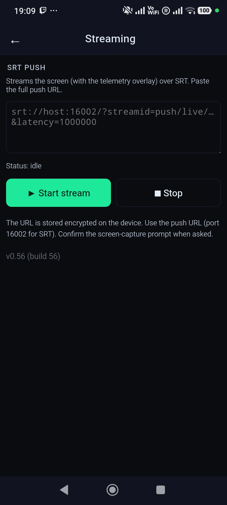</td>
  </tr>
  <tr>
    <td align="center">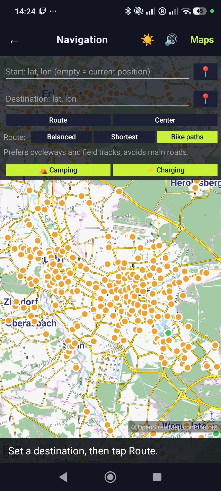</td>
  </tr>
</table>

## Installing the app

There are two ways to install the app. The normal one is a plain sideload from a file manager (below), which keeps working on every phone including Xiaomi/MIUI. A computer/ADB install is only a power-user fallback.

### Normal install (file manager)

Copy the `Laufbursche-Edition-vX.apk` file to your phone and open it in a file manager to install it. No PC and no cables are needed - offline maps are downloaded inside the app.

**Allow "install unknown apps" (Android 8 and newer).** Because the app does not come from the Play Store, Android must be allowed to install it. The first time you tap the downloaded APK, Android will ask you to let the app you opened it with (your file manager or browser) "install unknown apps" - enable that then tap the APK again to install. Alternatively you can pre-enable it under **Settings -> Apps -> [your file manager] -> Install unknown apps -> Allow**. This is only needed for the file-manager install path; the ADB path below does not need it.

### Installing after 2026 (the "advanced flow")

From 2026 Google is phasing in developer verification: on certified devices, in affected regions, an app whose developer has not verified their real-world identity can no longer be installed straight from a file manager without a one-time device opt-in. This app is distributed without a verified developer account (identity verification would expose the author's personal details), so on an affected device the user enables Android's "advanced flow" once. It is a per-device, one-time setup - nothing about it is per-app and nothing is required from the developer.

The one-time steps on the phone:

1. Turn on Developer mode: Settings -> About phone -> tap the build number 7 times.
2. Confirm you are not being talked through this by someone else (an anti-coercion check that blocks scam-driven installs).
3. Restart and re-authenticate - this cuts off any remote-access session or ongoing call an attacker might be using to watch along.
4. Wait out a one-time 24-hour "security wait" then confirm with your fingerprint/PIN that it is really you.
5. Done - you can now install apps from unverified developers from the file manager as usual. The installer still shows an "unverified developer" warning; tap "Install Anyway". You can allow this for 7 days or keep it on permanently.

Because it ships through Google Play services it is the normal file-manager path, not ADB, so it works on every phone including Xiaomi/MIUI - MIUI's separate ADB restriction is irrelevant here.

When it applies:

- The advanced flow itself becomes available around August 2026 through a Google Play services update, so if the option is not in your Developer options yet it simply has not rolled out to your device.
- Verification enforcement starts 2026-09-30 in Brazil, Indonesia, Singapore and Thailand and reaches most other regions (Germany included) in 2027 and later. Until it reaches your region, plain sideloading works unchanged and you do not need the advanced flow at all.

Sources: [9to5Google - the advanced flow, with screenshots](https://9to5google.com/2026/03/19/android-advanced-flow-sideloading/), [Google - developer verification FAQ](https://developer.android.com/developer-verification/guides/faq), [Help Net Security - rollout timeline](https://www.helpnetsecurity.com/2026/06/19/android-developer-verification-rollout-markets/).

### Installing via ADB

You can also install from a computer over ADB (Android platform-tools). This is mainly for developers; for normal use the file-manager route above is simpler and, on Xiaomi, the only friction-free option. Enable ADB once on the phone then install from the computer.

1. On the phone - enable it once:
   - Open Settings -> About phone and tap "Build number" 7 times to unlock Developer options.
   - Open Settings -> System -> Developer options and turn on "USB debugging".
   - Connect the phone to the computer by USB and confirm the "Allow USB debugging" prompt on the phone.
2. Install the APK from the computer:
   - `adb install -r Laufbursche-Edition-vX.apk` (the `-r` reinstalls/updates if a previous version is present).
   - If that fails because a different signature is installed, uninstall the old one first: `adb uninstall com.lb.edition` then `adb install`.
   - On Xiaomi (MIUI/HyperOS) a fresh ADB install of a new app is blocked with `INSTALL_FAILED_USER_RESTRICTED` unless you first enable "Install via USB" in Developer options, which Xiaomi ties to a signed-in Mi account plus an online check (there is no account-free ADB bypass on stock firmware without root). On Xiaomi the file-manager route above is the easier path - only that avoids Xiaomi's ADB gate.
3. Where to get ADB (Android SDK Platform-Tools) - it is a small standalone download, no full Android Studio needed:
   - Official downloads: https://developer.android.com/tools/releases/platform-tools
   - Windows: download the "SDK Platform-Tools for Windows" zip, extract it then run `adb.exe` from a terminal opened in that folder (or add the folder to PATH).
   - macOS: download the "SDK Platform-Tools for Mac" zip and run `./adb` from the extracted folder or install via Homebrew: `brew install android-platform-tools`.
   - Linux: download the "SDK Platform-Tools for Linux" zip and run `./adb` or install your distro package (Debian/Ubuntu: `sudo apt install adb`; Arch: `sudo pacman -S android-tools`; Fedora: `sudo dnf install android-tools`).

## Privacy & data protection

The app collects **nothing** - no accounts, no analytics, no telemetry, no tracking and no ads. Everything stays on your device. It uses the network only on your explicit action, reaching only: your scooter over **Bluetooth LE**; the **Hochschule Esslingen** OpenStreetMap mirror (`ftp-stud.hs-esslingen.de`) for offline **maps**; the **BRouter** server (`brouter.de`) for **routing** data; this project's **GitHub** repo (`github.com/Laufbursche42/sf-lb-edition`) for **POI** data (camping + EV charging) and for the in-app **app-update** check and download; and the **SRT** server URL you configure yourself for screen streaming. Nothing is ever sent to the developer or to any manufacturer backend.

See [PRIVACY.md](PRIVACY.md) for the full privacy policy.

## Permissions

The app requests only what it needs - see [PERMISSIONS.md](PERMISSIONS.md).

## Disclaimer & Trademarks

**Feasibility study, no warranty.** Laufbursche Edition is a feasibility study. The software is provided "as is". Nothing here promises that it is free of defects, that it works on your scooter or your phone, that a value it shows is correct or that a feature still works after the next scooter firmware or Android release.

**At your own risk.** You use this app and the settings it writes at your own risk. As far as the law allows, the developer is not liable for damage to the scooter, its controller, its battery or any other part, for lost data, for injury or for any other loss that comes out of using this software. Writing settings can leave a scooter unusable and can void its warranty. Raising the top speed removes the road approval (in Germany the ABE lapses) and a scooter set up outside its approved configuration does not belong on public roads. Keeping to road traffic law stays your job.

This is an independent, community project. It is not an official SoFlow app and the developer ("Laufbursche") is not affiliated with, endorsed by or connected to SoFlow. "SoFlow" and other product names are trademarks of their respective owners; the name is used here only descriptively to indicate the scooters this app works with. See [TRADEMARKS.md](TRADEMARKS.md) for details.

# For developers

## Architecture

A native Java `Activity` hosts a `WebView` dashboard (`assets/dashboard/telemetry.html`) bridged to native code via a `@JavascriptInterface` object named `LB`. Native BLE code implements the SoFlow protocol (see the "BLE protocol reference" section below): model classification, the three transports (Nordic UART, KingMeter, SO6), AES framing and the command and telemetry decoders. Screen streaming lives in the `com.lb.srt` module. Offline navigation uses **Mapsforge** for maps and **BRouter** for routing, with a foreground-service downloader for on-demand map and routing-segment data.

## Prerequisites

- **JDK 21** (JDK 17 also works). Point `JAVA_HOME` at your chosen JDK.
- **Android SDK** - the command-line SDK is enough. You need the `platform-tools` package plus the compile SDK the project builds against.
- **adb** ships inside the Android SDK platform-tools. It is only needed to install over USB (see [Installing via ADB](#installing-via-adb)); it is not required to build.

> **Version numbers - do not confuse them.** These are unrelated scales, so a higher or lower number in one does not say anything about "newer" or "older" in another (for example JDK 21 sitting next to minSdk 26 does not make 21 the older one):
>
> - **JDK 21** - the Java build tool (LTS). This is a Java version, unrelated to Android API levels. It is the version the Android build tooling (AGP/Gradle) officially supports; newer JDKs are not the supported baseline.
> - **compileSdk 36** - builds against Android 16 (the newest Android SDK).
> - **targetSdk 36** - targets Android 16.
> - **minSdk 26** - the OLDEST Android the app runs on (Android 8.0). This is a minimum/floor for device support, not "the version we use" - a lower minSdk means MORE phones are supported.
> - **Java language level 21** - the Java syntax the app source uses (compiled to Android).

## Building from source

Two build types are available. Debug is the quick everyday build; release is what you distribute publicly.

### Debug build

```bash
export JAVA_HOME=/path/to/jdk-21
./gradlew assembleDebug
```

The APK lands at `app/build/outputs/apk/debug/app-debug.apk`. It is signed automatically with Android's debug key (no keystore setup needed), it is debuggable, it is not optimized or minified. This is the build used for development and testing - the versioned test APKs are debug builds.

### Release build

```bash
./gradlew assembleRelease
```

The output lands in `app/build/outputs/apk/release/`. A release APK must be signed with your own keystore, so the freshly built APK is not installable until you configure signing. One-time setup:

1. Create a keystore once:

   ```bash
   keytool -genkeypair -v -keystore release.keystore -alias release \
     -keyalg RSA -keysize 2048 -validity 10000
   ```

2. Add a `signingConfigs { release { ... } }` block to `app/build.gradle`. Read the keystore path and passwords from a gitignored `keystore.properties` file so no secret is ever committed:

   ```properties
   # keystore.properties (DO NOT COMMIT)
   storeFile=release.keystore
   storePassword=your-store-password
   keyAlias=release
   keyPassword=your-key-password
   ```

3. Reference that signing config from `buildTypes.release` in `app/build.gradle`.
4. Build the signed APK with `./gradlew assembleRelease`.

Release builds are what you distribute publicly: optimized, shrinkable via `minifyEnabled`, signed with your own key. The keystore filename and alias shown here are just labels you can choose freely; only the keystore file itself and the passwords are secret and must stay private (gitignored, never committed).

### Debug vs release

| Aspect | Debug | Release |
|--------|-------|---------|
| Signing key | Android debug key (automatic) | your own keystore |
| Debuggable | yes | no |
| Optimization / minify | off | optional (on when `minifyEnabled true`) |
| Purpose | development / testing | public distribution |

Debug builds are only for local development and testing (fast iteration while developing). The builds that end users download from the GitHub Releases page are signed release builds, produced with the release build plus signing config described above and built by the release CI workflow - so users get a signed release, not a debug build. A release signing config is intentionally not committed - keystores must stay private and out of git (the pre-commit secret hook and `.gitignore` already block `*.jks` / `*.keystore` files).

## BLE protocol reference

The SoFlow BLE wire protocol - model families, transports, crypto, frame layout, command set and telemetry - is documented inline below. It is a written record of what the app implements, based on the tested reference behaviour; fields are marked where they stay uncertain. Numbers are unsigned bytes masked with `& 0xFF`; multi-byte fields are big-endian where noted.

### 1. Model families

Controllers fall into three families. The family decides the frame layout, the transport and how (and whether) frames are encrypted.

| Family | Start byte | Framing | Notes |
|--------|-----------|---------|-------|
| **D7** | `0xD7` outgoing | one-byte opcodes, additive checksum | the common case; a KingMeter variant answers with `0xD5` |
| **SO3** | `0xD7` outgoing | like D7, but byte 3 is a rolling secret, never encrypted | |
| **SO6** | none | two-byte command, the whole frame is AES | no over-the-air speed command |

Within D7 a `variant` distinguishes the older **so4** frame handling from the **so5base** (So5ProBase) handling.

**Classification.** The app matches the Bluetooth advertising name against a fixed, order-sensitive list of `SFS...` prefixes (for example `SFSO4UL` must be tested before `SFSO4`, and `SFS2K7` / `SFS2K1` before `SFS2K`). Newer units broadcast the plain name `SoFlow`; when the name does not classify, the app falls back to the exposed GATT service - the SO6 service means SO6, the KingMeter service means the SO One Pro path, otherwise it defaults to the Nordic So5ProBase path. The scan filter always also accepts `SoFlow` and `SOFLOW`.

### 2. Transports & connection

Three GATT transports carry the frames. The app resolves the expected service for the classified model and otherwise probes them in the order Nordic -> KingMeter -> SO6, remembering which one worked.

| Transport | Service | Write | Notify |
|-----------|---------|-------|--------|
| Nordic UART | `6e400001-b5a3-f393-e0a9-e50e24dcca9e` | `6e400002-...` | `6e400003-...` |
| KingMeter | `43480001-f001-4b49-4e47-204d45544552` | `43480002-...` | `43480003-...` |
| SO6 | `60000001-0000-1000-8000-00805f9b34fb` | `60000003-...` | `60000002-...` |

> SO6 swaps the roles: its write characteristic is `...0003` and its notify is `...0002`, the reverse of the other two.

After connecting the app runs a per-family handshake (a status nudge and, on the D7 family, a mode/enable frame) and then the controller streams telemetry unsolicited.

### 3. Crypto

AES-128 in ECB with **zero padding** (not PKCS7): pad the plaintext up to a multiple of 16 with zero bytes, encrypt block by block. When decrypting, only whole 16-byte blocks are processed and any remainder is ignored.

Two keys:

- **Key A** (D7 family): `30572F52364B3F473050415811632D2B`
- **Key B** (SO6): `20572F52364B3F473050415811632D2B`

Test vector, plaintext `D7 07 A9 00 00 C8 78` (a 20 km/h speed frame):

- Key A -> `69 57 0A C6 1E 3B 0F 01 9A BF C5 D6 BF AC 0A 7E`
- Key B -> `CD EF A3 3F 97 25 C3 24 57 EC F4 80 C5 35 A2 8A`

Whether a given frame is encrypted depends on the model's policy: **never** (SO1, SO2 Air, SO3, SO5 - always plaintext), **always** (SO X, the SO2 family, SO5 Pro, the SO One family, using key A; SO6 and SO4 UL using key B) or **fw52** (SO4 and SO myTIER encrypt only once the controller has reported a protocol version of 5.2 or newer). Incoming frames are decrypted only on SO6; D7 and SO3 replies are always plaintext.

### 4. Frame formats

**D7** (`buildFrameD7`):

```
body     = [LEN, OPCODE, BYTE3, payload...]
LEN      = payload.length + 5
BYTE3    = 0x00 (D7) or the rolling secret (SO3)
CHECKSUM = sum(body) & 0xff        // the 0xD7 start byte is not counted
frame    = [0xD7, body..., CHECKSUM]
```

Example, 20 km/h: `D7 07 A9 00 00 C8 78`. KingMeter replies start with `0xD5` instead of `0xD7` (GT2 / Core2); the receive parser accepts `0xD7` or `0xD5` and drops anything else. Outgoing frames always start `0xD7`.

**SO3** is the same as D7, except `BYTE3` is a rolling secret recomputed from three bytes of each status frame:

```
t = (b15 ^ b3) ^ (b16 ^ b3)
t = ((t + 0xCE) & 0xff) ^ 0xB2
t = ((t + 0xA5) & 0xff) ^ 0xCA
t = ((t + (b3 & 0x0F)) & 0xff) ^ 0x2B
t = ((t + 0x33) & 0xff) ^ 0x1D
return t & 0x7F
```

**SO6** (`buildFrameSO6`):

```
frame = [GROUP, SUB, payload.length, payload...]    // then the whole frame is AES with key B
```

No start byte, no checksum, no trailing token. On receive, decrypt first, then read `[group, sub, plen, payload...]`.

**Speed payload:** `v = round(kmh * 10); payload = [(v >> 8) & 0xff, v & 0xff]` (big-endian, 0.1 km/h steps).

### 5. Commands

For D7/SO3 the ack key is `op:OPCODE`; for SO6 it is `so6:group:sub`.

- **Max speed** - opcode `0xA9`, payload = speed payload. Offered only on models with a BLE speed command (all but SO6 and SO4 UL). This is the tuning lever: `km/h * 10` big-endian, with no clamp applied in the frame builder.
- **Ride mode** (eco 0 / normal 1 / sport 2) - SO3: `0xA4 [0x00, mode]`; older SO4: `0xA0 [modeByte0, 0x00]`; otherwise `0xA3 [mode]`.
- **Unlock** - SO6: `{05,01}` with PIN `303030303030` where required, otherwise empty; SO3: `0xA2 [00,00]`; older SO4: `0xA0 [modeByte0, 0x00]`; otherwise `0xA0 [0x00]`.
- **Lock** - SO6: `{05,0C} [0x01]`; SO3: `0xA2 [00,02]`; older SO4: `0xA0 [modeByte0, 0x01]`; otherwise `0xA0 [0x01]`.
- **Battery unlock** (D7 only) - SO4 (only from V52): `0xD5 [0x01]`; so5base: `0xD5 [0x00]`.
- **Headlight** (so5base) `0xA2 [on]`; **dark mode** (so5base) `0xD6 [on ? 0x00 : 0x01]` (inverted); **zero-start** (so5base) `0xA5 [on]`.
- **Units** - SO3: `0xAB [00, imperial ? 02 : 00]`; otherwise `0xA7 [imperial]`. Not offered on SO4.
- **Live-data nudge** - D7/SO4: `0x1D []`; SO3: `0xA0 [00,02]`; SO6: `{05,46} [0x01]`.

The device-name command is deliberately not implemented - writing it can throw the scooter out of the manufacturer app.

### 6. Telemetry

Frames arrive with the family's start byte; D7/SO4 and SO5ProBase carry live data in the `0x1D` frame, SO3 in `0x1D` (plus a `0x2D` status frame), SO6 in the `{05,46}` reply.

- **SO4 `0x1D`:** status byte (bit 0 headlight, bits 1-3 mode, bit 4 unit, bit 7 locked); speed, voltage and current each as a 0.1-scaled big-endian pair; a fault byte; the protocol version nibble (byte 12, which also selects whether AES is active); display and CPU version bytes; trip and total distance; battery percentage.
- **SO5ProBase `0x1D`:** the same shape with length guards - status, speed, voltage, current, a four-byte fault field, protocol / display / CPU versions, trip and total distance, battery percentage, a ride-duration triple and a dark-mode byte (0 = on), each present only when the frame is long enough.
- **SO3 `0x1D`:** status, speed, voltage, current and (when long enough) power and energy. Bytes 3, 15 and 16 feed the rolling secret. A separate `0x2D` frame carries the firmware nibbles, trip and total distance.
- **SO6 `{05,46}`:** after decryption, voltage (0.1-scaled, confirmed), current and power; further fields are uncertain. SO6 reports no speed, mode, battery, lock, firmware or distance.

Speed, voltage, current, power and energy are read as unsigned big-endian pairs scaled by 0.1 unless noted.

### 7. Operation notes

- **Write queue.** Serialise every write: each frame goes out only after the previous one plus a ~250 ms settle, even on failure - the controller drops frames that arrive too fast. The handshake frames go through the same queue. Prefer write-without-response.
- **Ack window.** Arm the command's ack key before sending and wait up to ~3000 ms for the first matching echo. An echo within the window means the command was accepted (not proof the value is actually being ridden). There is no app-level retry.
- **Connect reset.** On each connect, clear the local speed-unlock flag, the init-sent flag, the firmware major/minor and the SO3 secret. Outgoing frames are always `0xD7`; incoming are `0xD7` or `0xD5`.
- **Tuning caveat.** The max-speed command writes `km/h * 10` big-endian with no cap in the builder. Whether the controller rides above its factory clamp is a per-device test, not a guarantee.

## License

**What it covers and what it does not.** The licence covers what is in this repository: the Laufbursche Edition app, its build files and this documentation. It does **not** cover the scooter's Bluetooth protocol nor the manufacturer's firmware. Neither of those is ours, so neither is ours to license. Nothing here gives you any right in them. The protocol reference above is a written record of what the app implements, so that it can be understood, checked and maintained. Describing an interface is not the same as owning it. A description grants nothing. "SoFlow" and the scooter firmware belong to their respective owner, see [Disclaimer & Trademarks](#disclaimer--trademarks).

This project is source-available under the **PolyForm Noncommercial License 1.0.0** plus the Additional Terms in the `license.md` file. In plain language:

- You may **use, modify and share** the software for **noncommercial** purposes.
- **Commercial use requires the author's prior written permission.** To ask, contact the author.
- Any fork must be **renamed** by replacing "Laufbursche" with your own developer name or pseudonym while keeping the word "Edition". For example, if your pseudonym is "Falcon", name it "Falcon Edition". You must not use the name "Laufbursche Edition" (or any confusingly similar name) and must not use the "Laufbursche Edition" logo or brand artwork; use your own name and your own logo. Every fork must also **keep the origin notice** stating that it is based on the original "Laufbursche Edition" by Laufbursche in the app's **Version Info & Disclaimer** screen. That notice must not be removed or hidden.

See the [`license.md`](license.md) file for the full Additional Terms and the complete verbatim license text.

This is **source-available, not OSI "open source"**, by design: the noncommercial restriction means it does not meet the Open Source Definition and that is intentional. It is **not** a pure open-source project in the OSI sense - the source is made **public** so that anyone can inspect it, see exactly what the app does and modify it for their own **private** use.

Once you **publish** your own version (distribute a fork), you must observe the license terms: rename the app by replacing "Laufbursche" with your own developer name or pseudonym while keeping the word "Edition" (for example, "Falcon Edition") and never reuse the name "Laufbursche Edition" or the "Laufbursche Edition" logo, use your **own** name and your **own** logo, keep the origin notice in the app's **Version Info & Disclaimer** screen and keep it **noncommercial** unless you have the author's written permission.
</content>
</invoke>
